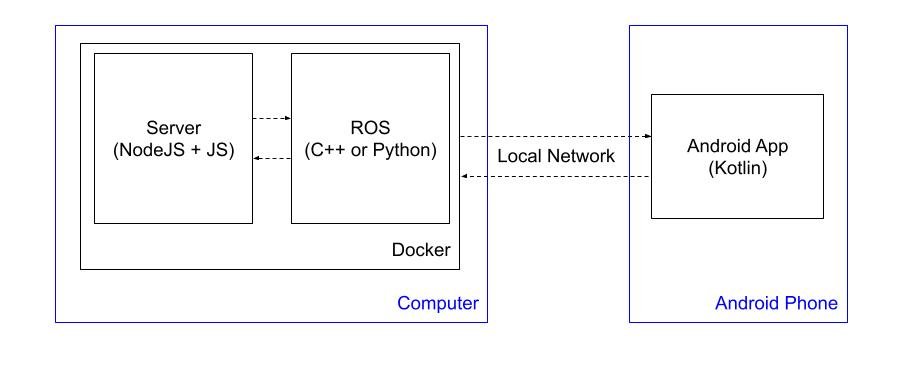
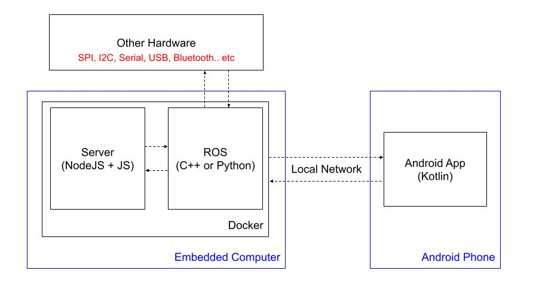

# MardanBot Platform #

## Hardware Configurations:
- MicroSD 64 GB
- [Raspberry Pi 4 Model B](https://www.raspberrypi.com/products/raspberry-pi-4-model-b/)
- [Raspberry Pi Camera Module V2](https://www.raspberrypi.com/products/camera-module-v2/)
- [Piromi Pan-Tilt HAT](https://www.piromi.com/pan-tilt-hat)
- [Arduino Uno](https://store.arduino.cc/usa/arduino-uno-rev3)
- [Zumo Robot for Arduino](https://www.pololu.com/product/2510)
- [Battery charger](https://www.amazon.com/dp/B098989NRZ)
- [Lithium Battery 50x60](https://www.amazon.com/dp/B08TTR1291)

## Rpi configurations:
- [Configure MicroSD]
- [Access Point configuration](https://www.raspberrypi.com/documentation/computers/configuration.html#setting-up-a-routed-wireless-access-point) (Follow the **Setting up a Bridged Wireless Access Point** section)
- [Docker for Rpi](https://dev.to/elalemanyo/how-to-install-docker-and-docker-compose-on-raspberry-pi-1mo)

## Software Tools:
- Visual Studio Code:
  - SSH Plugin
- Git
- Docker
- Docker compose

# Android App
Open with [Android Studio](https://developer.android.com/studio) the project located in the folder [AndroidApp](./AndroidApp/).

# Diagrams for illustration #
## Computers:

## Embedded Computers:

